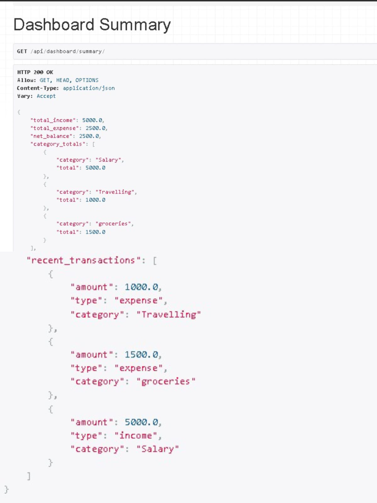
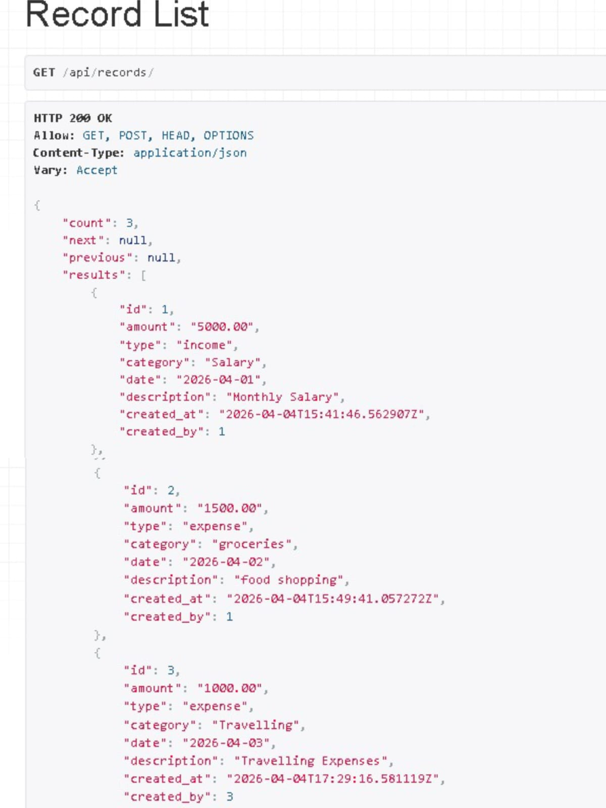
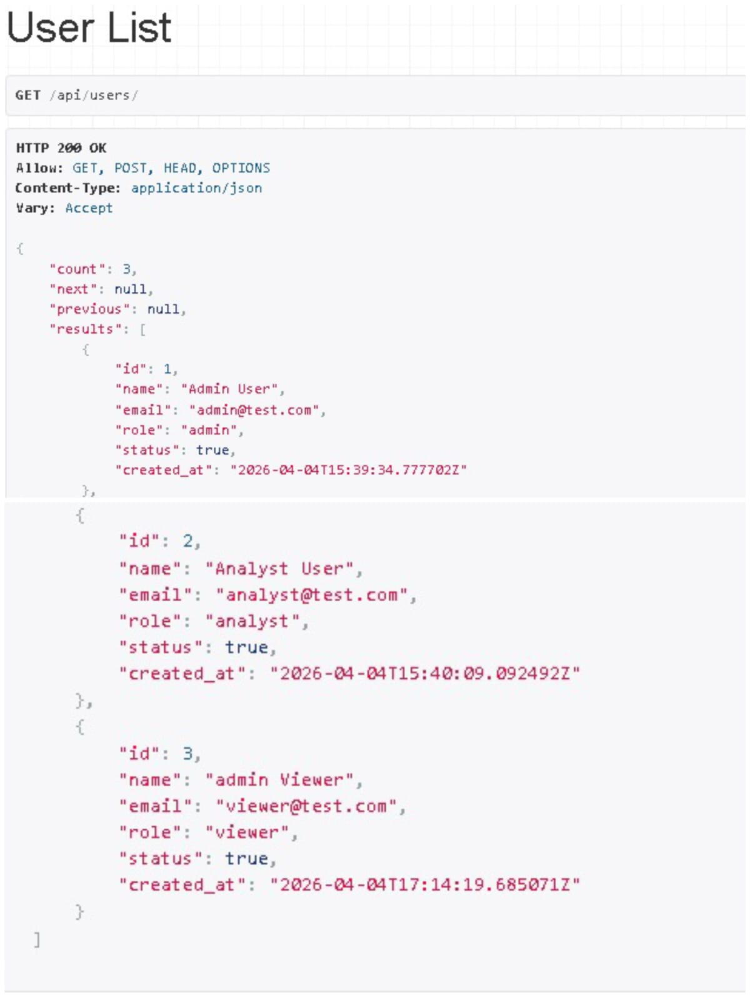

# Finance Data Processing and Access Control Backend

## Overview


This project implements a **Finance Dashboard Backend API** that manages financial records and enforces **role-based access control**.

The system allows different users (Viewer, Analyst, Admin) to interact with financial records and provides **aggregated financial insights for a dashboard**.

The backend is built using **Django and Django REST Framework**, focusing on clean architecture, structured APIs, and maintainable backend logic.

---

## Live API Deployment

The backend API is deployed and accessible online.

Base URL:

https://finance-dashboard-backend-production-3173.up.railway.app/

Example Endpoints:

Dashboard Summary
https://finance-dashboard-backend-production-3173.up.railway.app/api/dashboard/summary/

Users API
https://finance-dashboard-backend-production-3173.up.railway.app/api/users/

Financial Records API
https://finance-dashboard-backend-production-3173.up.railway.app/api/records/

The API can also be explored through the Django REST Framework browsable API interface.

---

## Features

### 1. User and Role Management

* Create and manage users
* Assign roles: **Viewer, Analyst, Admin**
* Activate or deactivate users
* Restrict actions based on user roles

### 2. Financial Records Management

Users can manage financial records including:

* Amount
* Type (Income / Expense)
* Category
* Date
* Description

Supported operations:

* Create records
* View records
* Update records
* Delete records

---

### 3. Dashboard Summary API

Provides aggregated financial insights including:

* Total income
* Total expenses
* Net balance
* Category-wise totals
* Recent transactions

---

### 4. Role-Based Access Control

| Role    | Permissions                                                  |
| ------- | ------------------------------------------------------------ |
| Viewer  | View dashboard summary                                       |
| Analyst | View financial records and dashboard                         |
| Admin   | Full access (Create, Read, Update, Delete users and records) |

---

### 5. Filtering Support

Records can be filtered using query parameters.

Example:

```
/api/records/?type=income
/api/records/?category=salary
/api/records/?date=2026-04-01
```

---

### 6. Pagination

API responses support pagination to efficiently handle large datasets.

Example:

```
/api/records/?page=1
/api/records/?page=2
```

---

## API Endpoints

### Users

```
GET    /api/users/
POST   /api/users/
PUT    /api/users/{id}/
DELETE /api/users/{id}/
```

---

### Financial Records

```
GET    /api/records/
POST   /api/records/
PUT    /api/records/{id}/
DELETE /api/records/{id}/
```

---

### Dashboard

```
GET /api/dashboard/summary/
```

---

## Tech Stack

* **Python**
* **Django**
* **Django REST Framework**
* **SQLite Database**

---

## Project Structure

```
finance_dashboard_backend
│
├── users
│   ├── models.py
│   ├── serializers.py
│   ├── views.py
│   └── urls.py
│
├── records
│   ├── models.py
│   ├── serializers.py
│   ├── views.py
│   └── urls.py
│
├── dashboard
│   ├── views.py
│   └── urls.py
│
├── config
│   ├── settings.py
│   └── urls.py
│
├── manage.py
├── requirements.txt
└── README.md
```

---

## Setup Instructions

### 1. Clone Repository

```
git clone <repository-url>
```

### 2. Navigate to Project Folder

```
cd finance_dashboard_backend
```

### 3. Create Virtual Environment

```
python -m venv venv
```

### 4. Activate Environment

Windows:

```
venv\Scripts\activate
```

---

### 5. Install Dependencies

```
pip install -r requirements.txt
```

---

### 6. Apply Database Migrations

```
python manage.py migrate
```

---

### 7. Run the Server

```
python manage.py runserver
```

Open in browser:

```
http://127.0.0.1:8000/api/
```

---

## API Screenshots

### Dashboard Summary



### Records API



### Users API


---

## Author

**Manoj V Poojar**

Backend Developer – Python | Django | REST APIs
